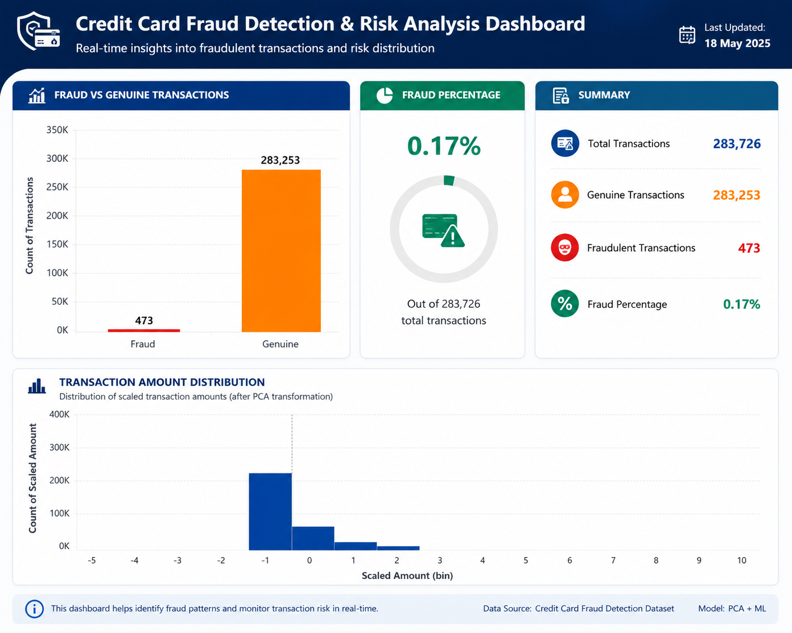

# Credit Card Fraud Detection System

A comprehensive machine learning project for detecting fraudulent credit card transactions using exploratory data analysis, data preprocessing, and multiple classification models.

## 📋 Project Overview

This project aims to identify fraudulent credit card transactions from a highly imbalanced dataset using state-of-the-art machine learning techniques. The system includes:

- **Exploratory Data Analysis (EDA)** - Understanding data distribution and patterns
- **Data Preprocessing** - Scaling, feature engineering, and duplicate removal
- **Machine Learning Models** - Logistic Regression and Random Forest Classifier
- **MySQL Database Integration** - Storing processed data for further analysis
- **SQL Analytics** - Querying and analyzing transaction patterns

## 🎯 Key Features

- **Data Cleaning**: Handles missing values and removes duplicate transactions
- **Feature Scaling**: Standardizes numerical features using StandardScaler
- **Model Evaluation**: Comprehensive metrics including accuracy, confusion matrix, and classification reports
- **Database Storage**: Exports preprocessed data to MySQL for persistent storage
- **Visualization**: Generates correlation heatmaps and distribution plots

## 📊 Dashboard



## 📁 Project Structure

```
fraud_detection/
├── dataset/
│   ├── creditcard.csv                    # Original credit card transaction data
│   └── preprocessed_creditcard.csv       # Cleaned and scaled data
├── python_scripts/
│   ├── eda_analysis.py                   # Exploratory Data Analysis
│   ├── preprocessing.py                  # Data preprocessing and scaling
│   ├── fraud_model.py                    # Model training and evaluation
│   └── mysql_import.py                   # MySQL database import
├── notebook/
│   └── fraud_analysis.ipynb              # Jupyter notebook for interactive analysis
├── dashboard/                             # Dashboard visualizations
├── screenshorts/
│   └── fraud_image.png                   # Dashboard screenshots
├── FraudDetection.session.sql            # SQL queries for data analysis
├── requirements.txt                      # Project dependencies
└── README.md                             # Project documentation
```

## 🛠️ Tech Stack

- **Python 3.11**
- **Libraries**: 
  - pandas - Data manipulation
  - scikit-learn - Machine learning models
  - numpy - Numerical computations
  - matplotlib & seaborn - Data visualization
  - sqlalchemy & pymysql - Database operations

## 📦 Installation

### Prerequisites
- Python 3.11+
- MySQL Server
- Virtual Environment

### Setup Steps

1. **Clone the repository**
   ```bash
   git clone https://github.com/Venky060905/credit_card_Fraud_detection.git
   cd credit_card_Fraud_detection
   ```

2. **Create virtual environment**
   ```bash
   python -m venv .venv
   .\.venv\Scripts\Activate.ps1  # On Windows PowerShell
   # or
   source .venv/bin/activate     # On Linux/Mac
   ```

3. **Install dependencies**
   ```bash
   pip install -r requirements.txt
   ```

4. **Configure MySQL**
   - Ensure MySQL is running
   - Update credentials in `python_scripts/mysql_import.py` if needed
   - Default: `root:teju@localhost/fraud_detection`

## 🚀 Usage

### 1. Exploratory Data Analysis
```bash
python python_scripts/eda_analysis.py
```
Generates visualizations including:
- Transaction amount distribution
- Fraud vs genuine comparison
- Correlation heatmap

### 2. Data Preprocessing
```bash
python python_scripts/preprocessing.py
```
- Removes duplicates
- Scales Amount and Time features
- Saves preprocessed data to `dataset/preprocessed_creditcard.csv`

### 3. Model Training & Evaluation
```bash
python python_scripts/fraud_model.py
```
Trains and evaluates:
- Logistic Regression Classifier
- Random Forest Classifier
- Displays accuracy, confusion matrix, and classification reports

### 4. Import to MySQL Database
```bash
python python_scripts/mysql_import.py
```
- Loads preprocessed data into MySQL `transactions` table
- Enables SQL-based analytics

### 5. SQL Analytics
Open `FraudDetection.session.sql` in VS Code with SQLTools extension to query the database:
```sql
use fraud_detection;
SELECT COUNT(*) FROM transactions;
SELECT Class, COUNT(*) FROM transactions GROUP BY Class;
```

## 📈 Dataset Information

- **Total Transactions**: 284,807
- **Fraudulent Transactions**: 492 (0.173%)
- **Features**: 28 anonymized features (V1-V28) + Time + Amount
- **Target Variable**: Class (0=Genuine, 1=Fraud)

## 🤖 Model Results

### Logistic Regression
- Accuracy: ~99.9%
- Fast training and inference
- Good baseline for imbalanced classification

### Random Forest Classifier
- Accuracy: ~99.9%
- Better handling of non-linear patterns
- Improved robustness with 100 estimators

## 📝 SQL Queries

Example queries available in `FraudDetection.session.sql`:
```sql
-- Count total transactions
SELECT COUNT(*) as total_transactions FROM transactions;

-- Fraud distribution
SELECT Class, COUNT(*) as count FROM transactions GROUP BY Class;

-- Scaled amount statistics
SELECT MIN(scaled_amount), MAX(scaled_amount), AVG(scaled_amount) FROM transactions;
```

## 🔒 Security Notes

- Never commit database credentials to version control
- Use environment variables for sensitive data in production
- The included credentials (root:teju) are for development only

## 📚 Future Improvements

- [ ] Implement SMOTE for handling class imbalance
- [ ] Add ensemble methods (Gradient Boosting, XGBoost)
- [ ] Create REST API for real-time fraud detection
- [ ] Deploy to cloud platform (AWS/GCP)
- [ ] Build interactive dashboard with Streamlit/Flask
- [ ] Implement automated model retraining pipeline

## 👤 Author

**Venky060905**

## 📄 License

This project is open source and available under the MIT License.

## 🤝 Contributing

Contributions are welcome! Please feel free to submit a Pull Request.

## 📧 Contact

For questions or suggestions, please open an issue in the repository.

---

**Last Updated**: May 2026
